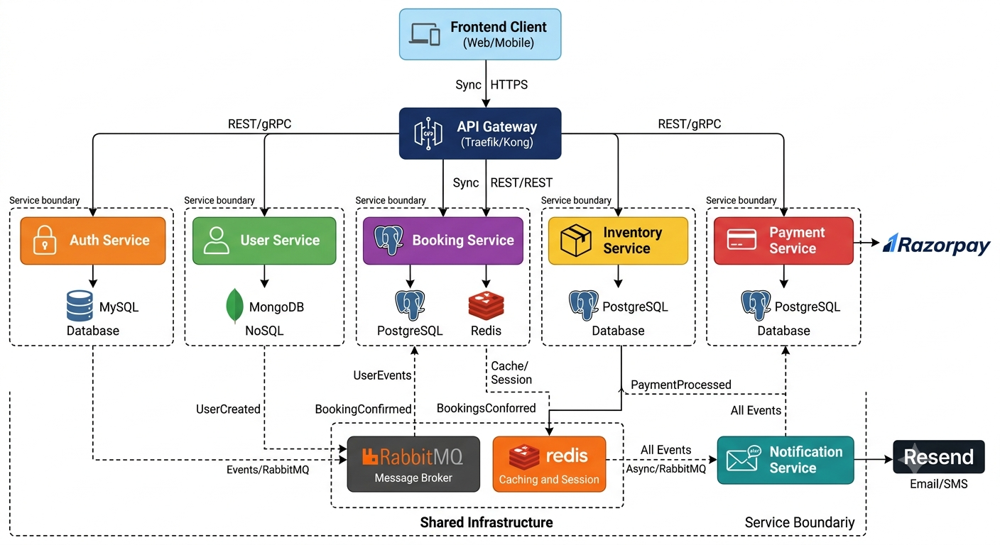
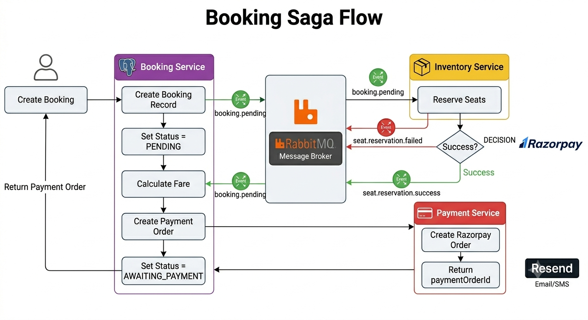
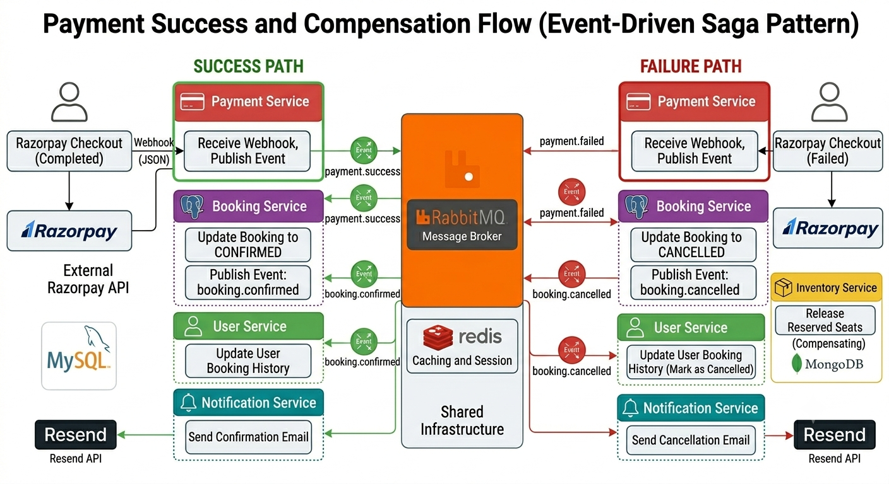

# 🚌 Bus Booking System

A production-inspired microservices-based Bus Booking Platform built with Node.js, TypeScript, Docker, RabbitMQ, Redis, gRPC, PostgreSQL, MySQL, and MongoDB.

This project was built to explore real-world backend engineering concepts including Microservices Architecture, Event-Driven Communication, Distributed Transactions using the Saga Pattern, Payment Integration, Role-Based Access Control (RBAC), Caching, and Containerized Deployments.

---

# 🚀 Features

## Authentication & Authorization

* JWT Access Tokens
* JWT Refresh Tokens
* Email Verification
* Role-Based Access Control (RBAC)
* USER Role
* OPERATOR Role
* ADMIN Role

---

## Booking Management

* Trip Search
* Seat Reservation
* Booking Creation
* Booking Confirmation
* Booking Cancellation
* Booking History
* Event-Driven Booking Processing
* Automatic Seat Release

---

## Payment Processing

* Razorpay Integration
* Payment Order Creation
* Payment Verification
* Webhook Processing
* Booking Confirmation after Payment

---

## Event-Driven Architecture

RabbitMQ is used for asynchronous communication between services.

Implemented Events:

### Authentication Events

* auth.user.registered

### Booking Events

* booking.pending
* booking.confirmed
* booking.cancelled

### Inventory Events

* seat.reservation.success
* seat.reservation.failed

### Payment Events

* payment.success
* payment.failed

---

## Notifications

* Email Verification Emails
* Booking Confirmation Emails
* Booking Cancellation Emails
* Event-Driven Notification Processing

---

# 🏗️ Architecture

## System Architecture



The platform follows a microservices architecture where each service owns its own database and business domain. Services communicate synchronously using gRPC for internal requests and asynchronously through RabbitMQ for event-driven workflows.

The API Gateway acts as the single entry point for clients and handles authentication, authorization, request routing, and API documentation.

Each service is independently deployable and responsible for a specific business capability:

* Auth Service manages authentication and user access.
* User Service manages user profiles and booking history.
* Inventory Service manages buses, routes, trips, and seat availability.
* Booking Service orchestrates the booking lifecycle.
* Payment Service handles Razorpay integration and payment processing.
* Notification Service handles email delivery and event-based notifications.

RabbitMQ enables loose coupling between services, while Redis is used for temporary booking expiration management and caching.

---

## Booking Saga Flow



The booking process is implemented using the Saga Pattern to coordinate a distributed transaction across multiple services without relying on a shared database transaction.

When a user creates a booking:

1. The Booking Service creates a booking record with status `PENDING`.
2. A `booking.pending` event is published.
3. The Inventory Service consumes the event and attempts to reserve the requested seats.
4. If seat reservation succeeds, a `seat.reservation.success` event is published.
5. The Booking Service consumes the success event, calculates the fare, and requests the Payment Service to create a Razorpay order.
6. The booking status is updated to `AWAITING_PAYMENT`.
7. The frontend receives the payment order details and redirects the user to Razorpay Checkout.

This approach allows each service to remain autonomous while ensuring business consistency through event-driven communication.

---

## Payment Success & Compensation Flow



After the user completes payment, Razorpay sends a webhook notification to the Payment Service.

### Successful Payment

1. The Payment Service verifies the webhook signature.
2. The payment status is updated to `SUCCESS`.
3. A `payment.success` event is published.
4. The Booking Service consumes the event and updates the booking status to `CONFIRMED`.
5. A `booking.confirmed` event is published.
6. User Service updates booking history.
7. Notification Service sends a booking confirmation email.

### Failed Payment (Compensation)

If payment fails:

1. The Payment Service publishes a `payment.failed` event.
2. The Booking Service updates the booking status to `CANCELLED`.
3. A `booking.cancelled` event is published.
4. The Inventory Service consumes the event and releases the previously reserved seats.
5. User Service updates booking history.
6. Notification Service sends a cancellation email.

This compensation mechanism ensures eventual consistency across services and prevents seats from remaining locked after unsuccessful payments.

---

# 🧩 Technology Stack

## Backend

* Node.js
* TypeScript
* Express.js

## Databases

* PostgreSQL
* MySQL
* MongoDB

## Messaging

* RabbitMQ

## Caching

* Redis

## Internal Communication

* gRPC

## Authentication

* JWT

## Payments

* Razorpay

## Email

* Resend

## Documentation

* Swagger / OpenAPI

## Containerization

* Docker
* Docker Compose

## Package Manager

* pnpm

---

# 📂 Monorepo Structure

```text
bus-booking/
│
├── services/
│   ├── gateway-service/
│   ├── auth-service/
│   ├── user-service/
│   ├── inventory-service/
│   ├── booking-service/
│   ├── payment-service/
│   └── notification-service/
│
├── packages/
│   └── common/
│
├── docs/
│   ├── architecture.png
│   ├── booking-saga.png
│   └── payment-compensation.png
│
├── docker-compose.yml
│
└── pnpm-workspace.yaml
```

---

# 🔄 Event Flow

## User Registration

```text
Auth Service
      │
      ▼
auth.user.registered
      │
      ▼
RabbitMQ
      │
      ▼
Notification Service
      │
      ▼
Verification Email
```

---

## Booking Creation

```text
Booking Service
      │
      ▼
booking.pending
      │
      ▼
Inventory Service
      │
      ▼
seat.reservation.success
      │
      ▼
Booking Service
      │
      ▼
Create Payment Order
```

---

## Payment Success

```text
Payment Service
      │
      ▼
payment.success
      │
      ▼
Booking Service
      │
      ▼
booking.confirmed
      │
      ├────► User Service
      │
      └────► Notification Service
```

---

## Payment Failure

```text
Payment Service
      │
      ▼
payment.failed
      │
      ▼
Booking Service
      │
      ▼
booking.cancelled
      │
      ├────► Inventory Service
      ├────► User Service
      └────► Notification Service
```

---

# 👥 Roles

## USER

Can:

* Search Routes
* Search Trips
* View Bus Details
* Create Bookings
* Cancel Own Bookings
* View Own Bookings
* Make Payments

---

## OPERATOR

Can:

* Create Buses
* Manage Own Buses
* Create Trips
* Manage Own Trips

---

## ADMIN

Can:

* Manage Users
* Manage Routes
* Manage Buses
* Manage Trips
* View All Bookings
* System Administration

---

# 🌐 Service Ports

| Service              | Port |
| -------------------- | ---- |
| Gateway Service      | 4000 |
| Auth Service         | 4001 |
| User Service         | 4002 |
| Inventory Service    | 4003 |
| Booking Service      | 4004 |
| Payment Service      | 4005 |
| Notification Service | 4006 |

---

# 🐇 RabbitMQ

Management Dashboard:

http://localhost:15672

Default Credentials:

Username: guest

Password: guest

---

# 📖 API Documentation

Swagger Documentation:

http://localhost:4000/docs

---

# 🛠️ Local Development Setup

## Prerequisites

Install:

* Node.js 22+
* pnpm
* Docker Desktop

---

## Clone Repository

```bash
git clone <repository-url>

cd bus-booking
```

---

## Install Dependencies

```bash
pnpm install
```

---

## Configure Environment Variables

Create environment files:

```text
services/auth-service/.env
services/user-service/.env
services/inventory-service/.env
services/booking-service/.env
services/payment-service/.env
services/notification-service/.env
services/gateway-service/.env
```

Use `.env.example` files as reference.

---

## Start Infrastructure

```bash
docker compose up -d
```

This starts:

* RabbitMQ
* Redis
* PostgreSQL
* MySQL
* MongoDB

---

## Run Services

```bash
pnpm dev
```

---

# 🐳 Docker Deployment

Build:

```bash
docker compose build
```

Start:

```bash
docker compose up -d
```

View Logs:

```bash
docker compose logs -f
```

Stop:

```bash
docker compose down
```

Remove Containers & Volumes:

```bash
docker compose down -v
```

---

# 🔒 Security Features

* JWT Authentication
* Refresh Token Rotation
* Role-Based Access Control
* Internal Service Authentication
* Razorpay Signature Verification
* Input Validation
* Rate Limiting
* Helmet Security Headers

---

# 🚧 Future Improvements

* Password Reset Flow
* Kubernetes Deployment
* Distributed Tracing
* Prometheus Monitoring
* Grafana Dashboards
* Centralized Logging
* CI/CD Pipeline
* Frontend Application
* OpenTelemetry Integration

---

# 👨‍💻 Author

Built as a backend engineering project focused on:

* Microservices Architecture
* Event-Driven Systems
* Saga Pattern
* RabbitMQ Messaging
* Distributed Transactions
* Payment Orchestration
* gRPC Communication
* Scalable Backend Design
